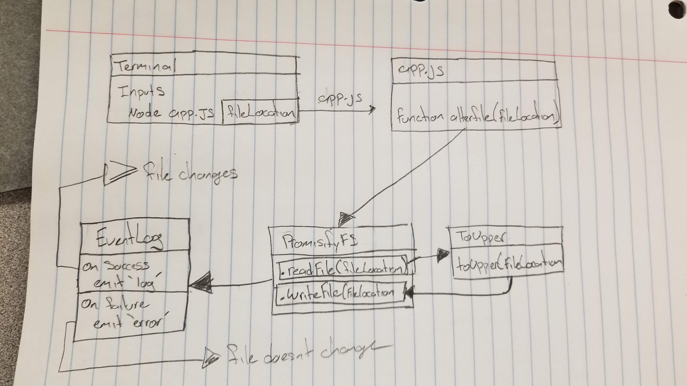

## Lab 16 Event Driven 

### Author: Felipe Delatorre

### Links and Resources
* [submission PR](https://github.com/401-advanced-javascript-felipe/lab16-eventDriven/pull/1)
* [travis](https://travis-ci.com/401-advanced-javascript-felipe/lab16-eventDriven/builds/115902319)

#### Documentation
* [jsdoc](./docs)

### Modules
#### `logger.js`
listens for and responds to events by doing a console.log() with something useful about the event.

#### `app.js`
Reads the file from the file system. Converts it’s contents to upper case. Writes it back to the file system
Following the write operation, report back to the user (console.log) the status.

#### `event.js`
Creates an event module that has a single event emitter instance

#### Running the app
* `npm start` - Reads `123.txt` turns in to uppercase. Then emits to logger.js to console.log() onto the terminal.

#### Tests
`npm test` - Will run test for functions that I have written 

#### UML

